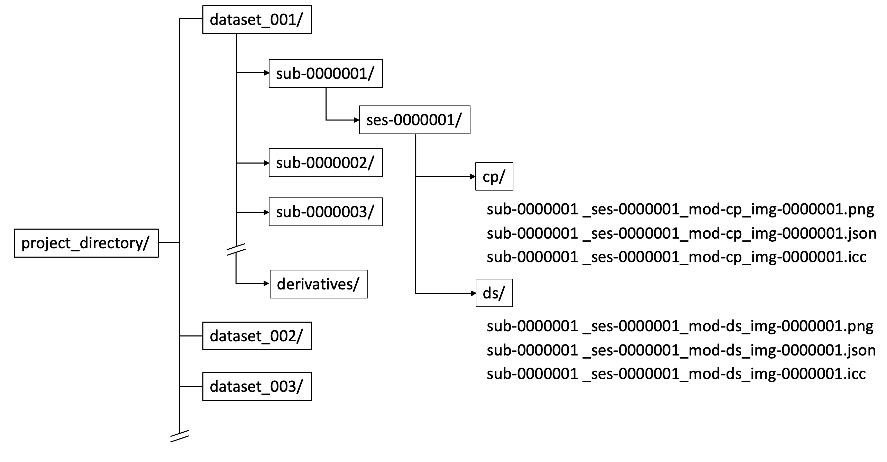

# SPIE2026_DermIDS

## DermIDS: Dermatology imaging data structure for scalable and interoperable AI systems

SPIE Medical Imaging 2026

Paper #: 13930-29

Feb 19, 2026

Vancouver, Canada

## DermIDS Schema

* DermIDS defines a dataset / subject / session / modality hierarchy.
* Each image is stored as a PNG file with a JSON sidecar containing image-specific clinical and technical metadata.
* All files are named based on their hierarchical folder structure: `sub-<subject_number>_ses-<session_number>_mod-<modality>_img-<image_number>`
* Supported modalities include clinical photography, dermoscopy, general photography, reflectance confocal microscopy, and surface 3D imaging.

  
